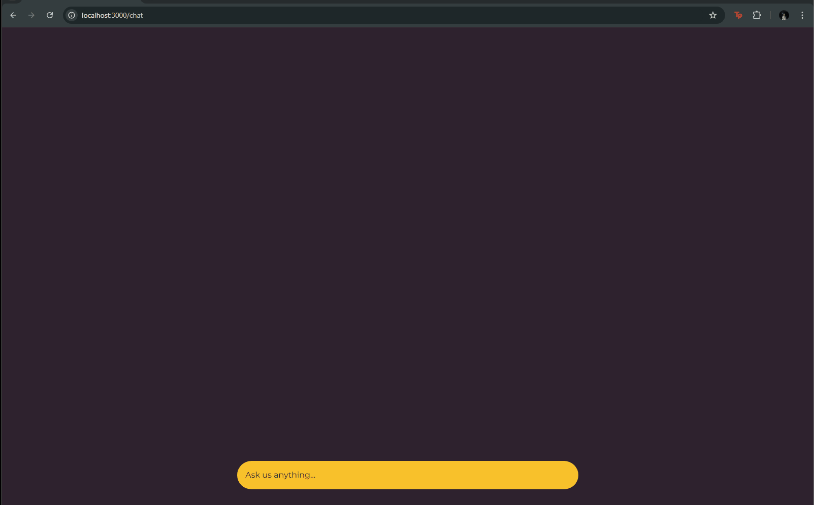
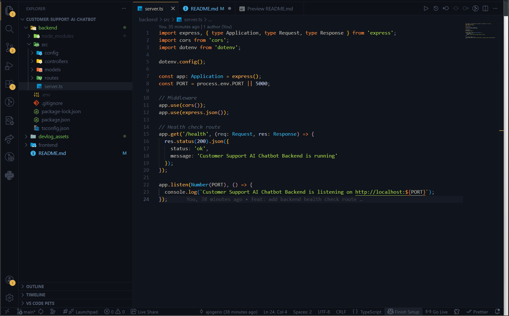

# 🤖 Customer Support AI Chatbot

A responsive, modern AI-driven chat platform built with Next.js, Typescript, Node, Express, Open AI, and PostgreSQL.

---

## 🚀 Getting Started

1.  **Clone the repo:**
    ```bash
    git clone [https://github.com/your-username/customer-support-ai-chatbot.git](https://github.com/your-username/customer-support-ai-chatbot.git)
    ```
2.  **Install dependencies:**
    ```bash
    npm install
    ```
3.  **Run the development server:**
    ```bash
    npm run dev
    ```

## 🛠️ Development Log

### **April 6, 2026**
* **Frontend Architecture:** Initialized the Next.js framework.
* **Core Layout:** Created the primary chat page and structure.
* **Component Development:** Built a library of modular UI components.
* **Styling:** * Implemented custom chat bubble styles.
    * Defined global typography and color palettes.

#### Initial Messaging Mechanism


---

### **April 7, 2026**
* **UI/UX Polish:** Refined the interface for better user flow and aesthetics.
* **Backend Setup:** Initialized the server environment to handle chat logic.

#### UI Improvements


#### Running The Server


---
